check verify commit

Learning Linux is one of the most valuable skills in the IT industry. It can help you get things done faster and more efficiently. Many of the world's powerful servers and supercomputers run on Linux.

I have been an active user of Linux for more than 8 years now. I have maintained critical Linux application and web servers in my role as a system administrator. I have also used Linux as my primary operating system for development and personal use.

Fun fact- as much as I am a fan of Linux right now, there was a time when I hated(yes hated, I can't find a better word) Linux. I used to skip the labs when I was studying software engineering. I just didn't have the patience to understand the commands or to identify the syntax errors in the scripts as they were very unforgiving. Today, I stand at a different place. So, you never actually know when the tables can be turned. 😃

I don't want any learner to go through unwanted pain when learning the command line. It seems daunting and it is easy to get overwhelmed. Don't worry, I have you covered. I'll go through the concepts step by step and I'll make sure that you understand the concepts before moving on to the next one. I won't teach only theory, but also some practical examples to make sure that you understand the concepts.

The contents of this book are carefully curated as I am only teaching the content that makes sense to me and the content that is fool-proof and to the point.

In this book, you'll learn the basics of the Linux command line, and then more advanced topics such as shell scripting and system administration. Whether you are new to Linux, or have been using it for years, this book has something for you.

# Table of Contents

- [Part 1: Introduction to Linux](#part-1-introduction-to-linux)
   * [1. Getting started with Linux](#1-getting-started-with-linux)
      + [What is Linux?](#what-is-linux)
      + [Why should you learn about Linux?](#why-should-you-learn-about-linux)
      + [What does it mean that Linux is an open-source operating system?](#what-does-it-mean-that-linux-is-an-open-source-operating-system)
      + [What is a Linux distribution?](#what-is-a-linux-distribution)
      + [How to install and access Linux?](#how-to-install-and-access-linux)
            * [Install Linux as the primary OS](#install-linux-as-the-primary-os)
         - [How to use Linux on a Windows machine?](#how-to-use-linux-on-a-windows-machine)
- [**Part 2: Introduction to Bash shell and system commands**](#part-1-introduction-to-bash-shell-and-system-commands)
   * [1. Getting started the Bash shell](#1-getting-started-the-bash-shell)
      + [Introduction to bash shell](#introduction-to-bash-shell)
      + [The prompt](#the-prompt)
   * [2. Writing your first command- Identifying Yourself: The **`whoami`** Command](#2-writing-your-first-command-identifying-yourself-the-whoami-command)
   * [3. Command structure](#3-command-structure)
   * [4. Commands reference](#4-commands-reference)
   * [5. Bash Commands and Keyboard Shortcuts](#5-bash-commands-and-keyboard-shortcuts)
- [**Part 3: Understanding Your Linux System**](#part-3-understanding-your-linux-system)
   * [1. Exploring Your Linux System](#1-exploring-your-linux-system)
      + [Discovering Your OS and Specs:](#discovering-your-os-and-specs)
         - [The **`uname`** Command- print system information](#the-uname-command-print-system-information)
         - [The **`lscpu`** Command- get details of the CPU architecture ](#the-lscpu-command-get-details-of-the-cpu-architecture)
- [**Part 4: Managing files from the command line**](#part-4-managing-files-from-the-command-line)
   * [1. The Linux file system heirarchy](#1-the-linux-file-system-heirarchy)
   * [2. Navigating the Linux file system](#2-navigating-the-linux-file-system)
   * [3. Managing files and directories](#3-managing-files-and-directories)
   * [4. Locating files and folders ](#4-locating-files-and-folders)
  
# Part 1: Introduction to Linux

## 1. Getting started with Linux

### What is Linux?

Linux is an open-source operating system that is based on the Unix operating system. It was created by Linus Torvalds in 1991. Open source means that the source code of the operating system is available to the public. This allows anyone to modify and distribute the operating system.

If you are curious, you can have a look at the source code of the Linux kernel at [GitHub](https://github.com/torvalds/linux)

### Why should you learn about Linux?

In today's data center landscape, Linux and Microsoft Windows stand out as the primary contenders, with Linux having a major share. Here are several compelling reasons to learn Linux:

- If you are accustomed to Windows environments, familiarity with Linux is essential for seamless interoperability.
- Given the prevalence of Linux hosting, there is a high chance that your application will be hosted on Linux. Hence learning Linux as a developer becomes increasingly valuable.
- With cloud computing becoming the norm, chances are high that your cloud instances will rely on Linux.
- Linux serves as the foundation for many operating systems for the Internet of Things (IoT) and mobile applications.
- In IT, opportunities abound for those skilled in Linux, remain consistently high.

### What does it mean that Linux is an open-source operating system?

First, what is open source? Open source software is software whose source code is freely accessible, allowing anyone to utilize, modify, and distribute it.

Whenever source code is created, it is automatically considered copyrighted, and its distribution is governed by the copyright holder through software licenses.

In contrast to open source, proprietary or closed-source software restricts access to its source code. Only the creators can view, modify, or distribute it.

Linux is open source primarily and it means that its source code is freely available. Anyone can view, modify, and distribute it. Developers from anywhere in the world can contribute to its improvement. This lays the foundation of collaboration which is an important aspect of open source software. The collaborative approach has led to the widespread adoption of Linux across servers, desktops, embedded systems, and mobile devices.

The most interesting aspect of Linux being open source is that anyone can tailor the operating system to their specific needs without being restricted by proprietary limitations.

> Fun fact: Chrome OS used by Chromebooks is also based on Linux.


After reading this book, you might be motivated to create your own Linux distribution! 😃

If you are curious about how the Linux kernel looks like, [here](https://github.com/torvalds/linux) is the GitHub link!

### What is a Linux distribution?

By this point, you know that you can re-use the Linux kernel code, modify it and create a new kernel. You can further combine different utilities and software to create a completely new operating system. So, a Linux distribution is a version of the Linux operating system that includes the Linux kernel, system utilities, and other software. Being open source, a Linux distribution is a collaborative effort involving multiple independent open-source development communities.

Today there are [hundreds](https://upload.wikimedia.org/wikipedia/commons/1/1b/Linux_Distribution_Timeline.svg) of Linux distributions to choose from, offering differing goals and criteria for selecting and supporting the software provided by their distribution.

Distributions vary from one another, but they generally have several common characteristics:

- A distribution consists of a Linux kernel.
- It supports user space programs.
- A distribution may be small and single-purpose or include thousands of open-source programs.
- Some means of installing and updating the distribution and its components should be provided.

Some known Linux distributions are:

1.  **Ubuntu**: One of the most widely used and popular Linux distributions. It is user-friendly and recommended for beginners. [Learn more about Ubuntu here](https://ubuntu.com/).
2.  **Linux Mint**: Based on Ubuntu, Linux Mint provides a user-friendly experience with a focus on multimedia support. [Learn more about Linux Mint here](https://linuxmint.com/).

3.  **Arch Linux**: Popular among experienced users, Arch is a lightweight and flexible distribution aimed at users who prefer a DIY approach.[Learn more about Arch Linux here](https://www.archlinux.org/).

4.  **Manjaro**: Based on Arch Linux, Manjaro provides a user-friendly experience with pre-installed software and easy system management tools. [Learn more about Manjaro here](https://manjaro.org/).
5.  **Kali Linux**: Kali Linux provides a comprehensive suite of security tools and is mostly focused on cybersecurity and hacking. [Learn more about Kali Linux here](https://www.kali.org/).
6.

### How to install and access Linux?

The best way to learn is to apply the concepts as you go. In this section, we'll learn how to install Linux on your machine so you can follow along. You'll also learn how to access Linux on a Windows machine.

I recommend you to follow any one of the methods mentioned in this section to get Linux so you may follow along.

##### Install Linux as the primary OS

Installing Linux as the primary OS is the most efficient way to use Linux as you can use the full power of your machine.

In this section, you will learn how to install Ubuntu, which is one of the most popular Linux distributions.
I have left out other distributions for now, as I want to keep things simple. You can always explore other distributions once you are comfortable with Ubuntu.

- Step 1: Download the Ubuntu iso
  Go to the official [website](https://ubuntu.com/download/desktop) and download the iso file.

- Step 2: Create a bootable pendrive
  There are many software that can create a bootable pendrive. I recommend using Rufus, as it is quite easy to use. You can download it from [here](https://rufus.ie/)

- Step 3: Boot from the pendrive
  Once your bootable pendrive is ready, insert it and boot from the pendrive. The boot menu depends on your laptop. You can google the boot menu for your laptop model.

- Step 4: Follow the prompts
  Once, the boot process starts, select `try or install ubuntu`.

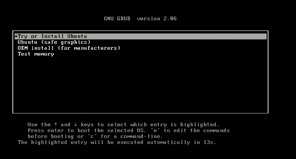

The process would take some time. Once the GUI appears, you can select the language, and keyboard layout and continue.
Enter your login and name. Remember it as you will need it to log in to your system and access full privileges.

Wait for the installation to complete.

- Step 5: Restart

Click on restart now and remove the pen drive.

- Step 6: Login

Login with the credentials you entered earlier.

And there you go!
Now you can install apps, and customize your desktop, and you are good to go!

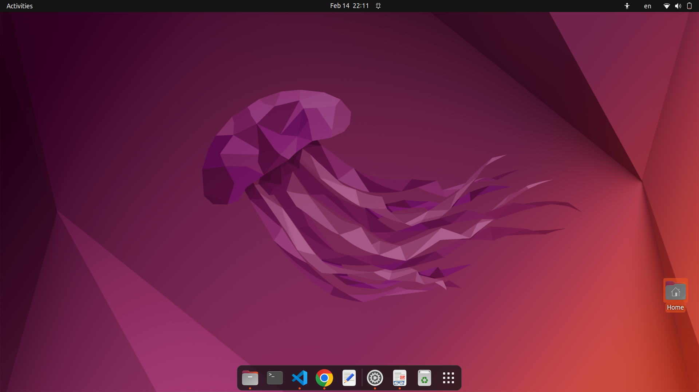

For advanced installation, you can explore the following topics:

- Disk partitioning.
- Setting swap memory for enabling hibernation.

> 💡 The shortcut for opening the terminal is `ctrl+alt+t`

#### How to use Linux on a Windows machine?

As a developer, you might need to run both Linux and Windows side by side. Luckily, there are some ways you can get the best of both worlds without getting different computers for each operating system.

In this section, you'll explore a few ways to use Linux on a Windows machine. Some of them are browser-based or cloud-based and do not need any OS installation before using them.

- **Option 1: "Dual-boot" Linux + Windows**
  With dual boot, you can install Linux alongside Windows on your computer, allowing you to choose which operating system to use at startup.

This requires partitioning your hard drive and installing Linux on a separate partition. With this approach, you can only use one operating system at a time.

- **Option 2: Use Windows Subsystem for Linux (WSL)**
  Windows Subsystem for Linux provides a compatibility layer that lets you run Linux binary executables natively on Windows.

Using WSL has some advantages:

The setup for WSL is simple and not time-consuming.
It is lightweight compared to VMs where you have to allocate resources from the host machine.
You don't need to install any ISO or virtual disc image for Linux machines which tend to be heavy files.
You can use Windows and Linux side by side.

**How to Install WSL2?**

1. First, enable the Windows Subsystem for Linux option in settings.

2. Go to Start. Search for "Turn Windows features on or off."

3. Check the option "Windows Subsystem for Linux" if it isn't already.

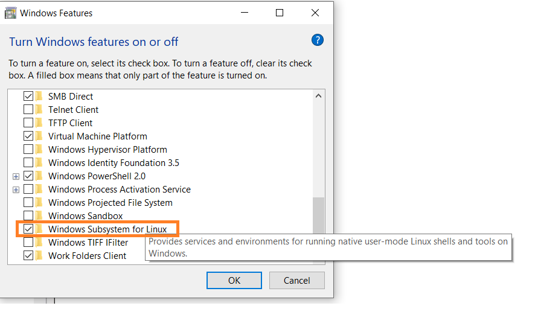

4. Next, open your command prompt and provide the installation commands.

Open Command Prompt as an administrator:

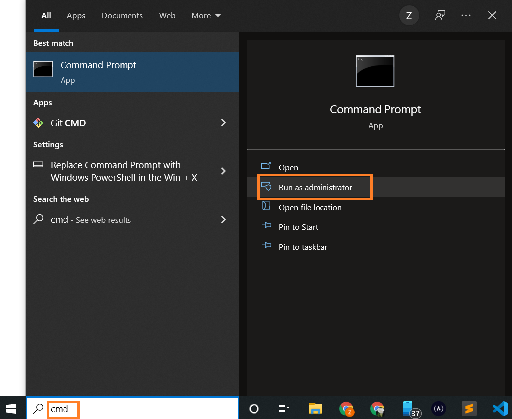

Run the command below:

```
wsl --install
```

This is the output:

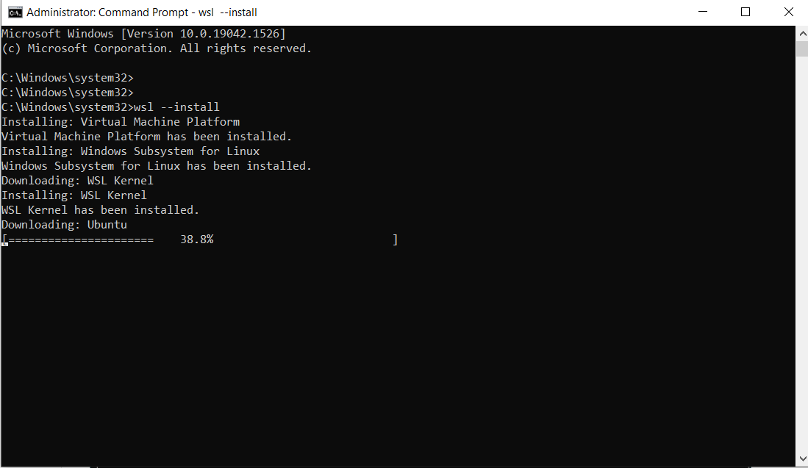

> Note: By default, Ubuntu will be installed.

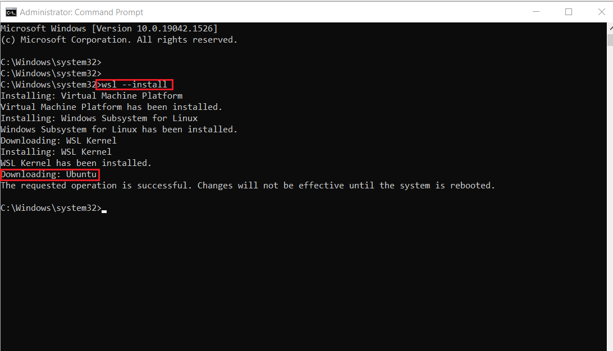

Once installation is complete, you'll need to reboot your Windows machine. So, restart your Windows machine.

After restarting, you might see a window like this:

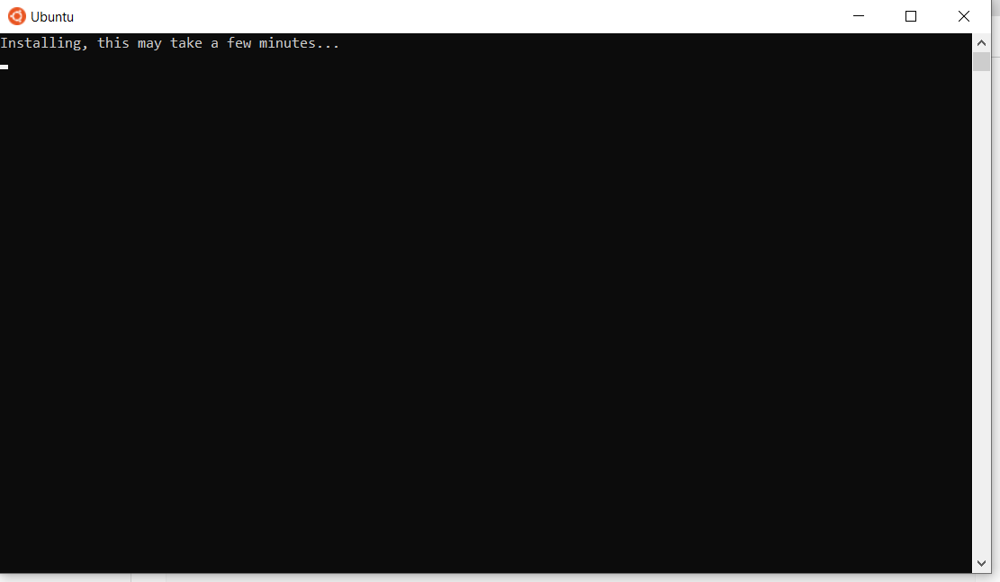

Once installation of Ubuntu is complete, you'll be prompted to enter your username and password.

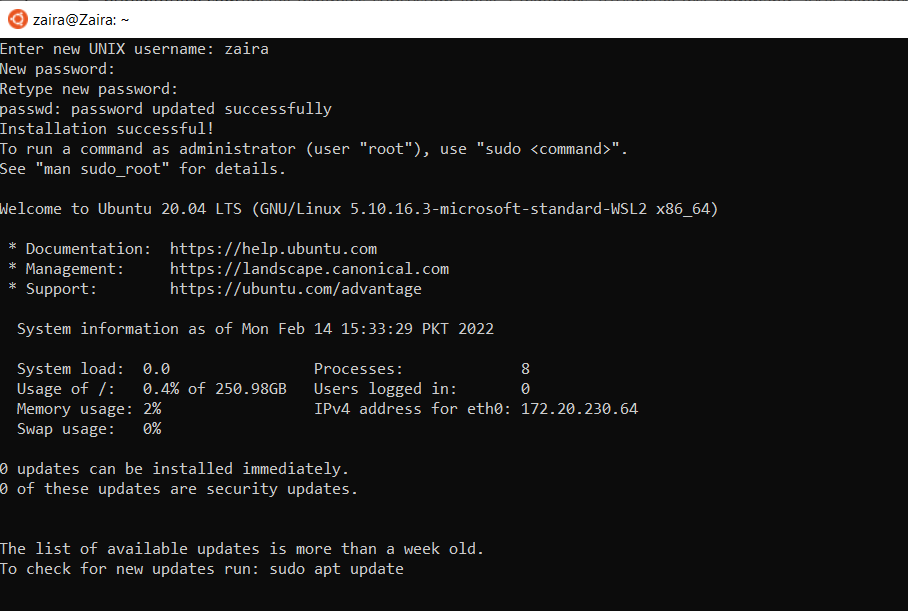

And, that's it! You are ready to use Ubuntu.

Launch Ubuntu by searching from the start menu.

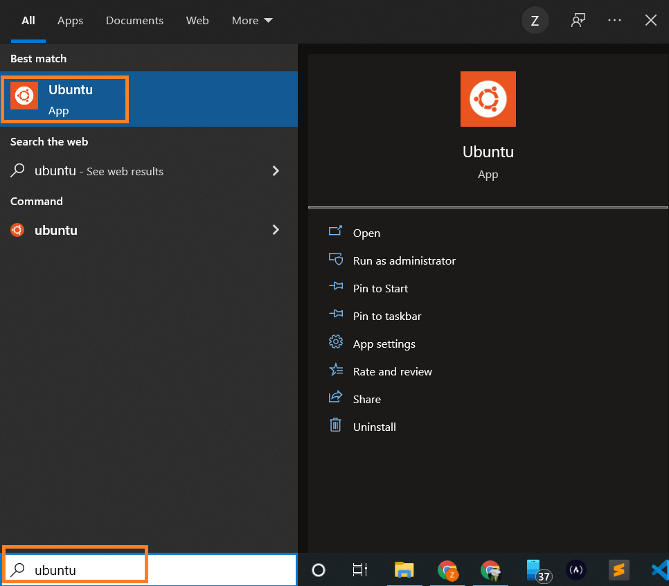
And here we have our Ubuntu instance launched.

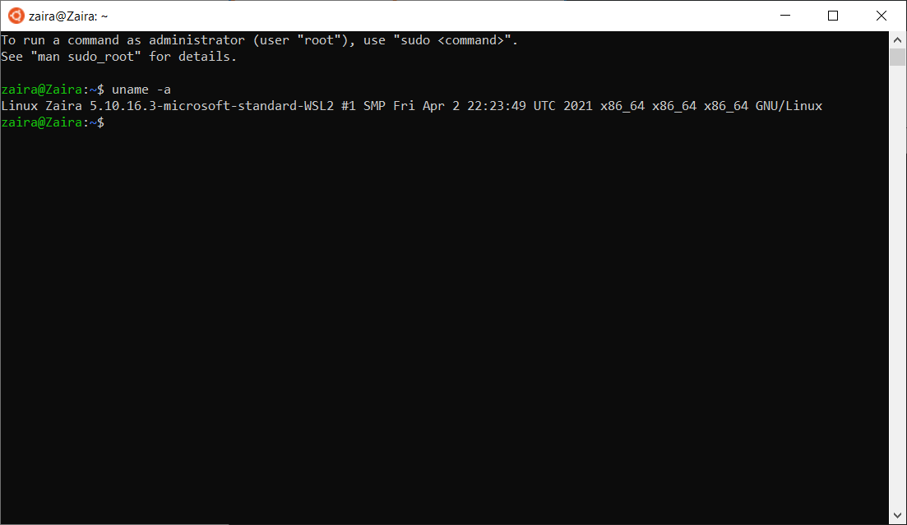

**Option 3: Use a Virtual Machine (VM)**

A virtual machine (VM) is a software emulation of a physical computer system. It allows you to run multiple operating systems and applications on a single physical machine simultaneously. Here's a detailed explanation of VMs:

You can use virtualization software such as Oracle VirtualBox or VMware to create a virtual machine running Linux within your Windows environment. This allows you to run Linux as a guest operating system alongside Windows.

VM software provides options to allocate and manage hardware resources for each VM, including CPU cores, memory, disk space, and network bandwidth. You can adjust these allocations based on the requirements of the guest operating systems and applications.

Here are some of the options available for virtualization:

- [Oracle virtual box](https://www.virtualbox.org/)
- [Multipass](https://multipass.run/)
- [VMware workstation player](https://www.vmware.com/content/vmware/vmware-published-sites/us/products/workstation-player.html.html)

**Option 4: Use a Browser-based Solution**

Browser-based solutions are particularly useful for quick testing, learning, or accessing Linux environments from devices that don't have Linux installed.

You can either use online code editors or web-based terminals to access Linux. Note that you usually don't have full administration privileges in these cases.

**- Online code editors**

Online code editors offer editors with built-in Linux terminals. While their primary purpose is coding, you can also utilize the Linux terminal to execute commands and perform tasks.

[Replit](https://replit.com/) is an example of an online code editor, where you can write your code and access the Linux shell at the same time.
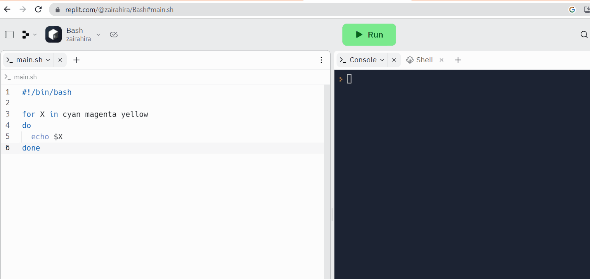

Replit provides a code editor and a Linux shell.

**- Web-based Linux terminals**

Online Linux terminals allow you to access a Linux command-line interface directly from your browser. These terminals provide a web-based interface to a Linux shell, enabling you to execute commands and work with Linux utilities.

One such example is [JSLinux](https://jslinux.org/). The screenshot below shows a ready-to-use Linux environment:

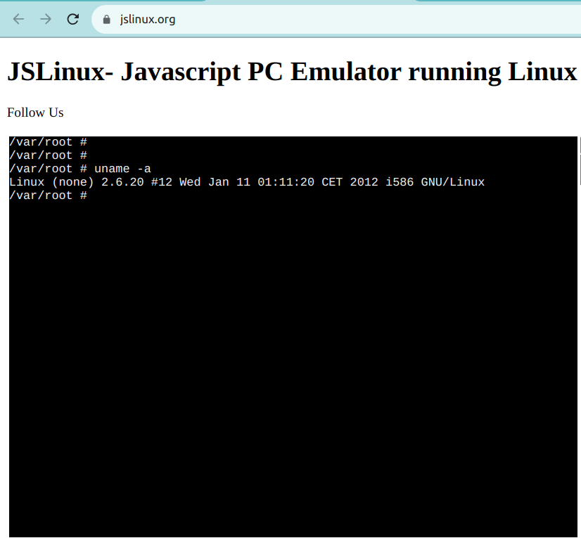

**Option 5: Use a Cloud-based Solution**

Instead of running Linux directly on your Windows machine, you can consider using cloud-based Linux environments or virtual private servers (VPS) to access and work with Linux remotely.

Services like Amazon EC2, Microsoft Azure, or DigitalOcean provide Linux instances that you can connect to from your Windows computer. Note that some of these services offer free tiers, but they are not usually free in the long run.

# Part 2: Introduction to Bash shell and system commands

## 1. Getting started the Bash shell
### Introduction to bash shell

The Linux command line is provided by a program called the shell. Over the years, the shell program has evolved to cater to various options.

Different users can be configured to use different shells. But, most users prefer to stick with the current default shell. The default shell for many Linux distros is the GNU Bourne-Again Shell (bash). Bash is succeeded by Bourne shell (`sh`).

To find out your current shell, you can use the below command. 

```bash
echo $SHELL
```
Command breakdown:
- The `echo` command is used to print on the terminal. 
- The `$SHELL` is a special variable that holds the name of the current shell.


In my setup, the output is `/bin/bash`. This means that I am using the bash shell.

```bash
# output
echo $SHELL
/bin/bash
```
Bash is very powerful as it can simplify certain operations that are hard to accomplish efficiently with a GUI. Remember that most servers do not have a GUI, and it is best to learn to use the powers of a command line interface (CLI).

### The prompt

When a shell is used interactively, it displays a  `$`  when it is waiting for a command from the user. This is called the shell prompt.

`[username@host ~]$`

If the shell is running as root(you'll learn more about the root user later on), the prompt is changed to  `#`. The superuser shell prompt looks like this:

`[root@host ~]#`

## 2. Writing your first command- Identifying Yourself: The **`whoami`** Command

It's time to use the terminal.
Excited? 😃

You can get the username you are logged in with by using the `whoami` command. This command is useful when you are switching between different users and want to confirm the current user.

Just after the `$` sign, type `whoami` and press enter.

```bash
whoami
```

my out/in

```bash
zaira@zaira-ThinkPad:~$ whoami
zaira

```

## 3. Command structure

A command is a program that performs a specific operation. Once you have access to the shell, you can
enter any command after the `$` sign and see the output on the terminal.

Generally, Linux commands follow this syntax:

```bash
command [options] [arguments]
```

Here is the breakdown of the above syntax:

- `command`: This is the name of the command you want to execute. `ls` (list), `cp` (copy), and `rm` (remove) are common Linux commands.

- [options]: Options, or flags, often preceded by a hyphen (-) or double hyphen (--), modify the behavior of the command. They can change how the command operates. For example, `ls -a` uses the `-a` option to display hidden files in the current directory. 

- [arguments]: Arguments are the inputs for the commands that require one. These could be filenames, user names, or other data that the command will act upon. For example, in the command `cat access.log`, `cat` is the command and `access.log` is the input. As a result, the `cat` command displays the contents of the `access.log` file. 

Options and arguments are not required for all commands. Some commands can be run without any options or arguments, while others might require one or both to function correctly. You can always refer to the command's manual to check the options and arguments it supports.

> tip: You can view a command's manual using the `man` command.

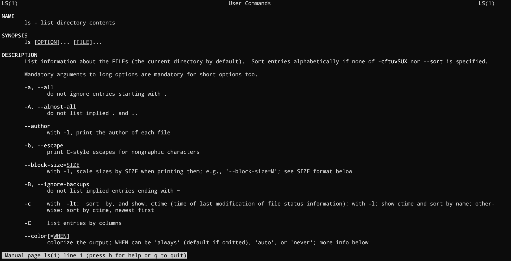
You can see options for a command in detail using `man ls`

## 4. Commands reference

some commonly used commands
go to this section

use man

## 5. Bash Commands and Keyboard Shortcuts

| Operation | Shortcut  |
|--|--|
| Look for previous command| Up Arrow |
| Jump to the beginning of the previous word| Ctrl+LeftArrow |
| Clear characters from the cursor to the end of the command line? |  Ctrl+K |
| Complete commands, file names, and options? | Pressing Tab |
| Jumps to the beginning of the command line? | Ctrl+A |
| Displays the list of previous commands     | history |


# **Part 3: Understanding Your Linux System**

## **1. Exploring Your Linux System**

### Discovering Your OS and Specs:
#### The **`uname`** Command- print system information
You can get detailed system information from the `uname` command. 

When you provide the `-a` option, it prints all the system information.

```bash
zaira@zaira~$ uname -a
# output
Linux zaira-ThinkPad 6.5.0-21-generic #21~22.04.1-Ubuntu SMP PREEMPT_DYNAMIC Fri Feb  9 13:32:52 UTC 2 x86_64 x86_64 x86_64 GNU/Linux
```

In the output, above,
- `Linux`: Indicates the operating system.
- `zaira`: Represents the hostname of the machine.
- `6.5.0-21-generic #21~22.04.1-Ubuntu SMP PREEMPT_DYNAMIC Fri Feb  9 13:32:52 UTC 2`: Provides information about the kernel version, build date, and some additional details.
- `x86_64 x86_64 x86_64`: Indicates the architecture of the system.
- `GNU/Linux`: Represents the operating system type.


#### The **`lscpu`** Command- get details of the CPU architecture 

The `lscpu` command in Linux is used to display information about the CPU architecture. When you run `lscpu` in the terminal, it provides details such as:

- Architecture of the CPU (e.g., x86_64)
- CPU op-mode(s) (e.g., 32-bit, 64-bit)
- Byte Order (e.g., Little Endian)
- CPU(s) (number of CPUs), etc
Let's try it out.

```bash
zaira@zaira~$ lscpu
# output
Architecture:            x86_64
  CPU op-mode(s):        32-bit, 64-bit
  Address sizes:         48 bits physical, 48 bits virtual
  Byte Order:            Little Endian
CPU(s):                  12
  On-line CPU(s) list:   0-11
Vendor ID:               AuthenticAMD
  Model name:            AMD Ryzen 5 5500U with Radeon Graphics
    CPU family:          23
    Model:               104
    Thread(s) per core:  2
    Core(s) per socket:  6
    Socket(s):           1
    Stepping:            1
    CPU max MHz:         4056.0000
    CPU min MHz:         400.0000
```

That was a whole lot of information! Remeber you can always skim the relevant information using specific flags.


# **Part 4: Managing files from the command line**

## **1. The Linux file-system heirarchy**

All files in Linux are stored in a file-system. It follows an inverted-tree like structure because the root is at the top most. 

The `/` is the root directory and the starting point of the file system. The root directory contains all other directories and files on the system. The `/` character aslo serves as a directory separator between path names. For example, `/home/alice` forms a complete path.

The image below shows the complete file system hierarchy. Each directory servers a specific purpose.

Note that, this is not an exhaustive list and different distributions may have different configurations.

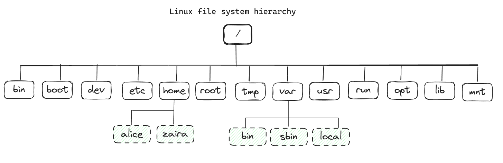

Here is a table that shows the purpose of each directory:

|Location|Purpose|
|--|--|
|/bin| Essential command binaries|
|/boot| Static files of the boot loader, needed in order to start the boot process.|
|/etc| Host-specific system configuration|
|/home| User home directories|
|/root| Home directory for the administrative root user|
|/lib | Essential shared libraries and kernel modules|
|/mnt | Mount point for mounting a filesystem temporarily|
|/opt | Add-on application software packages|
|/usr| Installed software and shared libraries|
|/var| Variable data that is also persistent between boots|
|/tmp| Temporary files that are accessible to all users|

💡 Learn more about the file-sytem using the `man hier` command.

You can check your file-system using the `tree -d -L 1` command. You can modify the `-L` flag to change the depth of the tree.

```bash
zaira@zaira-ThinkPad:/$ tree -d -L 1
.
├── bin -> usr/bin
├── boot
├── cdrom
├── data
├── dev
├── etc
├── home
├── lib -> usr/lib
├── lib32 -> usr/lib32
├── lib64 -> usr/lib64
├── libx32 -> usr/libx32
├── lost+found
├── media
├── mnt
├── opt
├── proc
├── root
├── run
├── sbin -> usr/sbin
├── snap
├── srv
├── sys
├── tmp
├── usr
└── var

25 directories
```     

### absolute path vs relative path

 
This  list  is  not  exhaustive; different distributions and
       systems may be configured differently.


## **2. Navigating the Linux file system**

### Locating your current directory using the `pwd` command

It is easy to get lost in the Linux file system, especially if you are new to the command line. You can locate your current directory using the `pwd` command. 

Here is an example:

```bash
zaira@zaira:~$ pwd
# output
/home/zaira
```

### Changing directories using the `cd` command

The command to change directories is `cd` and it stands for "change directory". You can use the `cd` command to navigate to a different directory.

You can use a relative path or an absolute path.

home>bob>documents>work>project


For example, if you want to navigate the above file strcture from start to end, the command would be like this:

```bash
zaira@zaira:~$ cd home/bob/documents/work/project

```

✏️ Notes

Some other commonly used `cd` shortcuts are:


| Command | Description |
|--|--|
| `cd ..` | Go back one directory |
| `cd ../..` | Go back two directories |
| `cd` or `cd ~` | Go to the home directory |
| `cd -` | Go to the previous directory |


## 3. Managing files and directories
cp mv rm mkdir rmdir

When working with files and directories you might want to copy, move, remove and create new files and directories. Here are some commands that can help you with that.

### Creating new directories using the `mkdir` command

You can create an empty directory using the `mkdir` command.

```bash
# creates an empty directory named "foo" in the current folder

zaira@zaira:~$ mkdir foo
```

You can also create directories recursively using the `-p` option.

```bash
zaira@zaira-ThinkPad:~/samples$ mkdir -p tools/index/helper-scripts

zaira@zaira-ThinkPad:~/samples$ tree
# output 
.
└── tools
    └── index
        └── helper-scripts

3 directories, 0 files
```

### Creating new files using the `touch` command

The `touch` command creates an empty file. You can use it like this:
  
  ```bash
  # creates empty file "file.txt" in the current folder
  zaira@zaira:~$ touch file.txt
  ```
If you want to create multiple files in a single command, the file names can be chained together.

```bash
# creates empty files "file1.txt", "file2.txt", and "file3.txt" in the current folder

zaira@zaira:~$ touch file1.txt file2.txt file3.txt
```


### Removing files and directories using the `rm` and `rmdir` command

The `rm` command is used to remove both files and non-empty directories. 

| Command | Description |
|--|--|
| `rm file.txt` | Removes the file `file.txt` |
| `rm -r directory` | Removes the directory `directory` and its contents |
| `rm -f file.txt` | Removes the file `file.txt` without prompting for confirmation |
|`rmdir` directory| Removes an empty directory|

## 4. Locating files and folders using the `find` command

The  `find`  command lets you efficiently search for files, folders, and character and block devices.

Below is the basic syntax of the  `find`  command:

```bash
find /path/ -type f -name file-to-search

```

Where,

-   `/path`  is the path where file is expected to be found. This is the starting point to search files. The path can also be`/`or  `.`  which represent root and current directory, respectively.
-   `-type`  represents the file descriptors. They can be any of the below:

`f`  –  **Regular file**  such as text files, images and hidden files.

`d`  –  **Directory**. These are the folders under consideration.

`l`  –  **Symbolic link**. Symbolic links point to files and are similar to shortcuts.

`c`  –  **Character devices**. Files that are used to access character devices are called character device files. Drivers communicate with character devices by sending and receiving single characters (bytes, octets). Examples include keyboards, sound cards and mouse.

`b`  –  **Block devices**. Files that are used to access block devices are called block device files. Drivers communicate with block devices by sending and receiving entire blocks of data. Examples include USB, CD-ROM

-   `-name`  is the name of the file type that you want to search.

### How to search files by name or extension

Suppose we need to find files that contain "style" in their name. We'll use this command:

```bash
find . -type f -name "style*"
```

**Output**

```bash
#output
zaira@zaira:~/samples$ find . -type f -name "style*"
./style.css
./styles.css
```

Now let's say we want to find files with a particular extension like  `.html`. We'll modify the command like this:

```bash
find . -type f -name "*.html"
```

**Output**

```bash
# output
zaira@zaira-ThinkPad:~/samples$ find . -type f -name "*.html"
./services.html
./blob.html
./index.html
```

### How to search hidden files

Hidden files are represented by a dot in the beginning of the filename. They are normally hidden, but can be viewed with  `ls -a`  in the current directory.

We can modify the  `find`  command as shown below to search for hidden files.

```bash
find . -type f -name ".*"
```

**Output**

```bash
zaira@zaira:~/samples$ ls -la
# folder contents
total 5
drwxrwxr-x  2 zaira zaira 4096 Mar 26 14:17 .
drwxr-x--- 61 zaira zaira 4096 Mar 26 14:12 ..
-rw-rw-r--  1 zaira zaira    0 Mar 26 14:17 .bash_history
-rw-rw-r--  1 zaira zaira    0 Mar 26 14:17 .bash_logout
-rw-rw-r--  1 zaira zaira    0 Mar 26 14:17 .bashrc

zaira@zaira:~/samples$ find . -type f -name ".*"
# find output
./.bash_logout
./.bashrc
./.bash_history
```

List of hidden files in my home directory

### How to search log files and configuration files

Log files usually have the extension  `.log`, and we can find them like this:

```bash
 find . -type f -name "*.log"
```

Similarly, we can search for configuration files like this:

```bash
 find . -type f -name "*.conf"
```
### How to search other files by type

We can search for character block files by providing  `c`  to  `-type`:

```bash
find / -type c
```

Similarly, device block files can be found by using  `b`:

```bash
find / -type b
```

### How to search directories

In the example below, we are finding the folders using  `-type d` flag.

```bash
zaira@zaira:~/samples$ ls -l
# folder contents
drwxrwxr-x 2 zaira zaira 4096 Mar 26 14:22 hosts
-rw-rw-r-- 1 zaira zaira    0 Mar 26 14:23 hosts.txt
drwxrwxr-x 2 zaira zaira 4096 Mar 26 14:22 images
drwxrwxr-x 2 zaira zaira 4096 Mar 26 14:23 style
drwxrwxr-x 2 zaira zaira 4096 Mar 26 14:22 webp 
zaira@zaira:~/samples$ 
zaira@zaira:~/samples$ find . -type d 
# find directory output
.
./webp
./images
./style
./hosts
```

### How to search files by size

An incredibly helpful use of the  `find`  command is to list files based on a particular size.

```bash
find / -size +250MB
```

Here, we are listing files whose size exceeds 250MB

Other units include:

-   `G`: GigaBytes.
-   `M`: MegaBytes.
-   `K`: KiloBytes
-   `c`  : bytes.

Just replace <Unit Type> with the relevant unit.

```bash
find <directory> -type f -size +N<Unit Type>

```

### How to search files by modification time

```bash
find /path -name "*.txt" -mtime -10 
```

-   **-mtime +10**  means you are looking for a file modified 10 days ago.
-   **-mtime -10**  means less than 10 days.
-   **-mtime 10** If you skip + or – it means exactly 10 days.